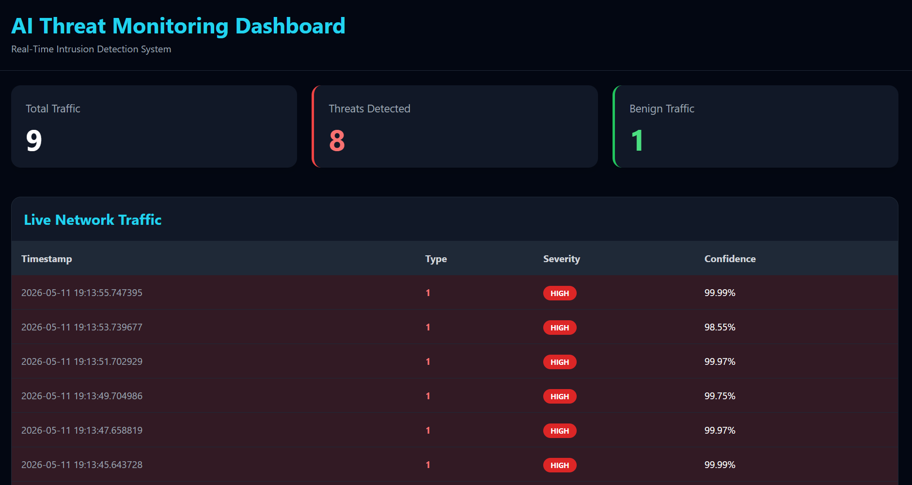

# CICIDS 2017 Intrusion Detection Project

## Overview

This project focuses on building a machine learning-based intrusion detection system using the **CICIDS 2017 dataset**.
The goal is to classify network traffic as benign or malicious and identify different types of attacks.

---

## Dataset

The dataset is too large to be stored in this repository.

Download it from:
👉 https://cicresearch.ca/CICDataset/CIC-IDS-2017/

---

## 🚀 How to Run

```bash
cd backend
uvicorn app:app --reload
```

Open **http://127.0.0.1:8000** in your browser.

